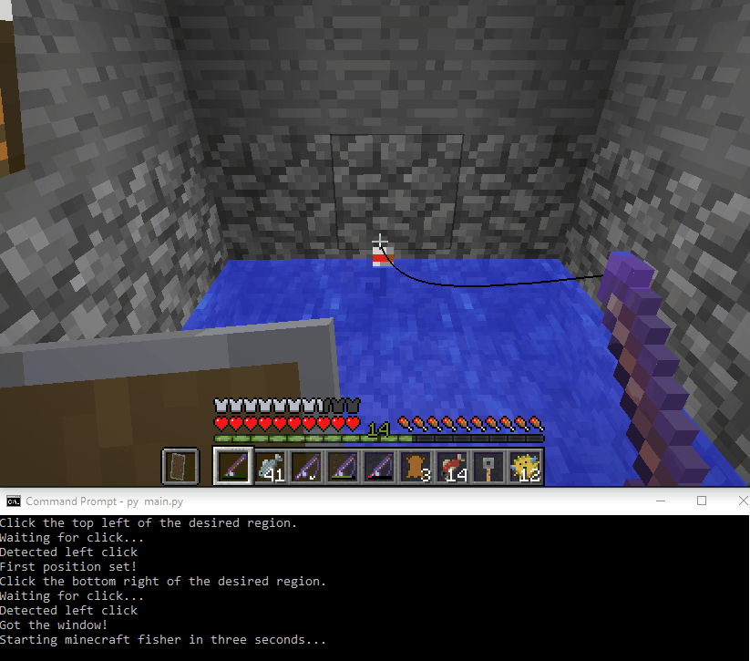

# Minecraft Fisher

A script that automates fishing in Minecraft for use on single-player worlds. 

## Requirements and installation:

This code has been tested with Python 3.6, but *should* work with Python 3+.

Required packages:
- Pillow
- numpy
- pyautogui
- win32api
- win32gui

After ensuring these packages are installed, simply navigate to this repository in your terminal and type: 
`python main.py`

## How to use:

After opening up Minecraft and finding a place to fish:
1. Start fishing (place your fishing bob in the water)
2. Start the program
3. Follow the prompts in the terminal. 

The code will ask you to set a window for the bobber and then proceed to start automatically fishing for you!

## How it works:

Every 1/3 of a second, the program will take a screenshot of the identified window on screen and determine the amount of "red" in the picture from the fishing bobber. If the average R-band value in the picture dips below a certain threshold, then the bobber most likely dove underwater, indicating a fish is on the line! It then right-clicks to reel in the fish and then starts the whole cycle over.

